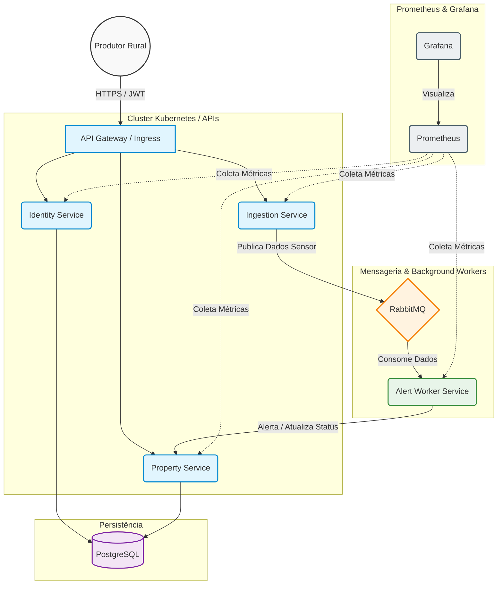

# 🌾 AgroSolutions - Plataforma de Agricultura de Precisão (IoT)

**FIAP - Pós-Graduação em Arquitetura de Sistemas .NET com Azure**  
**Hackathon Final (Fase 5) - Grupo 59**

---

## 👥 Integrantes

* **Elias Oliveira Prates** (RM364079)
* **William Henrique Cirino** (RM361204)
* **Thiago Martins Reboredo** (RM364884)

---

## 📖 Sobre o Projeto

A AgroSolutions é uma cooperativa agrícola em transição para a **Agricultura 4.0**. Este projeto é o MVP de uma plataforma baseada em IoT e análise de dados, projetada para processar informações de sensores de campo (umidade, temperatura, precipitação) e gerar alertas inteligentes para os produtores rurais.

---

## 🎥 Vídeo de Demonstração (Pitch e Execução)
O vídeo com a apresentação da arquitetura, justificação técnica e demonstração do MVP a funcionar localmente no Kubernetes encontra-se no link abaixo:
🔗 **[INSERIR O LINK DO YOUTUBE AQUI]**

---

## 🏗️ Decisões Arquiteturais e Padrões (Fase 5)

Nossa solução adota **Clean Architecture** e princípios **SOLID**:

* **Microsserviços Desacoplados (SRP):** Separação de responsabilidades entre Ingestão (`IngestionService`), Análise de Negócio (`AlertService`), Cadastro (`PropertyService`) e Identidade (`IdentityService`).
* **Inversão de Dependência (DIP):** Uso extensivo de interfaces para garantir alta testabilidade (25 testes unitários implementados).
* **Mensageria Resiliente:** Comunicação assíncrona via **RabbitMQ + MassTransit**, garantindo que nenhum dado de sensor seja perdido mesmo em picos de carga.
* **Observabilidade:** Stack **Prometheus + Grafana** configurada para monitorar em tempo real a umidade do solo e o status dos alertas.

---

## 🔒 Conformidade com a LGPD

Implementamos controles rigorosos de privacidade e transparência:

* **Direito ao Esquecimento:** Endpoint `DELETE /api/user/me` que remove completamente a conta e dados atrelados.
* **Segurança By Design:** Senhas hasheadas com **BCrypt**, tráfego protegido por **JWT** e credenciais gerenciadas via **Kubernetes Secrets**.

---

## 🚀 Como Executar o Projeto (Ambiente K8s Local)

Para rodar o projeto do zero utilizando Docker Desktop com Kubernetes habilitado:

### 1. Setup Automatizado

Na raiz do projeto, execute o script PowerShell passando seu Token do GitHub (necessário para baixar as imagens do GHCR):

```powershell
./start-agro.ps1 -GithubToken "seu_token_aqui"
```

### 2. Exposição de Portas (Túneis)

Mantenha abertos terminais separados para os seguintes túneis:

**Identity (5001):**
```bash
kubectl port-forward svc/identity-service 5001:80 -n agrosolutions
```

**Property (5002):**
```bash
kubectl port-forward svc/property-service 5002:80 -n agrosolutions
```

**Ingestion (5003):**
```bash
kubectl port-forward svc/ingestion-service 5003:80 -n agrosolutions
```

**Grafana (3000):**
```bash
kubectl port-forward svc/grafana 3000:3000 -n agrosolutions
```

### 3. 🧪 Validação do Fluxo de Integração (Postman)

A coleção completa de testes está disponível na pasta `/postman` deste repositório. Para validar o MVP de ponta a ponta sem necessidade de configuração manual de IDs, siga os passos abaixo:

**Importação:** Importe o arquivo `AgroSolutions.postman_collection.json` no seu Postman.

**Automação:** A coleção utiliza scripts de teste para capturar tokens e IDs automaticamente, armazenando-os em variáveis de coleção.

**Execução Sequencial:** Execute os requests na ordem numérica (1 a 5):

1. **01 - Cadastro/Login:** Cria o produtor rural e gera o JWT, salvando o `owner_id` e o `jwt_token`.
2. **02 - Criar Propriedade:** Registra a fazenda vinculada ao proprietário e captura o `property_id`.
3. **03 - Criar Talhão:** Define a área de cultivo dentro da propriedade e captura o `talhao_id`.
4. **04 - Ingestão de Sensores:** Simula o envio de dados IoT (umidade < 30%) via `IngestionService`.
5. **05 - Verificação de Alerta:** Consulta o status do talhão para confirmar o processamento do **Drought Alert** (Alerta de Seca) gerado pelo `AlertService`.

---

## 📊 Monitoramento

Acesse o **Grafana** em `http://localhost:3000` para visualizar os dashboards de monitoramento em tempo real após executar os túneis necessários.

**Credenciais padrão:**
- Usuário: `admin`
- Senha: `admin`

O dashboard `AgroSolutions Overview` exibe métricas de umidade do solo e alertas processados em tempo real.

---

## ⚙️ CI/CD e Qualidade de Software
* **Pipeline de Integração Contínua:** Utilizámos o **GitHub Actions** para garantir a qualidade do código. Sempre que um *push* é feito, a esteira compila a solução e executa obrigatoriamente os **25 testes unitários** desenvolvidos, impedindo falhas em produção.

---

## ✅ Requisitos Não Funcionais

* **Escalabilidade:** Garantida com **HPA (Horizontal Pod Autoscaler)** no `IngestionService` para suportar picos de ingestão IoT.
* **Resiliência:** Garantida via **RabbitMQ**, evitando perda de dados caso o `AlertService` fique indisponível.
* **Privacidade:** Garantida por **criptografia de senhas (BCrypt)**, uso de **Kubernetes Secrets** e **endpoint de deleção** conforme LGPD.

## 📄 Licença

Este projeto foi desenvolvido como parte do Hackathon Final da FIAP e está disponível para fins educacionais.

## 🧩 Diagrama de Arquitetura

